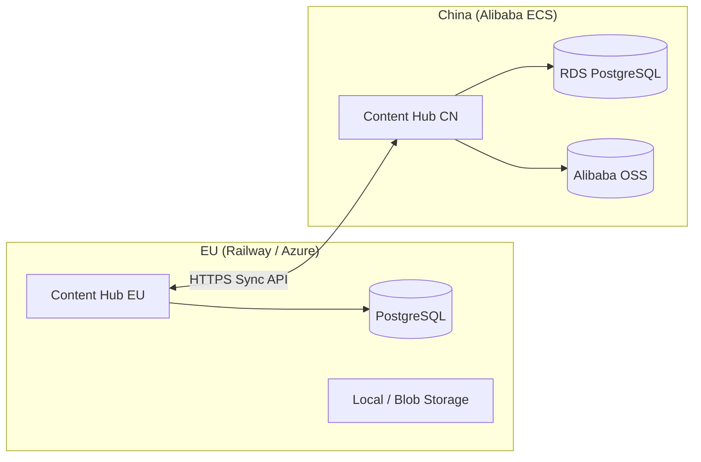

# China Deployment — Unified Carbonauten Platform (Sprint 5)

Regional deployment for China with Alibaba OSS storage and HTTP-based EU ↔ CN sync for articles and certificates.

## Architecture



Sync uses authenticated HTTP endpoints (`/api/sync/export` and `/api/sync/import`) instead of Kafka MirrorMaker for the MVP. Kafka MM2 can be added later for event streaming.

## Environment variables

### Both regions

| Variable | EU example | CN example | Purpose |
|----------|------------|------------|---------|
| `DEPLOYMENT_REGION` | `eu` | `cn` | Region identifier |
| `STORAGE_BACKEND` | `local` | `oss` | File storage backend |
| `SYNC_PEER_URL` | `https://platform.cn.carbonauten.com` | `https://app.carbonauten.com` | Peer instance URL |
| `SYNC_PEER_REGION` | `cn` | `eu` | Peer region label |
| `SYNC_API_KEY` | shared secret | same secret | Sync authentication |

### China OSS (when `STORAGE_BACKEND=oss`)

| Variable | Example |
|----------|---------|
| `OSS_ENDPOINT` | `oss-cn-shanghai.aliyuncs.com` |
| `OSS_BUCKET` | `carbonauten-content-hub-cn` |
| `OSS_ACCESS_KEY_ID` | RAM access key |
| `OSS_ACCESS_KEY_SECRET` | RAM secret |
| `OSS_OBJECT_PREFIX` | `uploads` |

Install optional dependency: `pip install oss2`

### China URL

Point DNS `platform.cn.carbonauten.com` to the Alibaba ECS load balancer or SLB. Use ICP-compliant hosting in a China region (e.g. `cn-shanghai`).

## Sync flow

1. IT master opens **Dashboard** → **Regional sync** → **Run EU ↔ CN sync**
2. Local instance **pushes** articles + certificates to peer `/api/sync/import`
3. Local instance **pulls** from peer `/api/sync/export` and merges (last-write-wins by `updated_at`)
4. Sync history is stored in `sync_logs`

Manual API (same `X-Sync-Key` header):

```bash
curl -H "X-Sync-Key: $SYNC_API_KEY" https://app.carbonauten.com/api/sync/export
curl -X POST -H "X-Sync-Key: $SYNC_API_KEY" -H "Content-Type: application/json" \
  -d @export.json https://platform.cn.carbonauten.com/api/sync/import
```

## Terraform scaffold

See `deploy/terraform-china/` for:

- VPC + vSwitch
- Security group (HTTP/HTTPS)
- OSS bucket
- ECS instance user-data stub for Docker deployment

```bash
cd services/content-hub/deploy/terraform-china
terraform init
terraform plan -var="region=cn-shanghai"
```

## Health check

`GET /api/health` returns:

- `deployment_region`
- `storage_backend`
- `oss_configured`
- `sync_configured`
- `sync_peer_region`

## Out of scope (Sprint 5 MVP)

- Kafka MirrorMaker 2 (planned for production scale)
- Geo-DNS / global load balancer automation
- 21Vianet M365 tenant wiring
- Binary file replication between EU and CN (metadata sync only)

## Next steps

1. Provision Alibaba ECS + RDS in `cn-shanghai`
2. Deploy Content Hub Docker image with CN env vars
3. Set matching `SYNC_API_KEY` on both EU and CN
4. Verify sync from Dashboard as IT master
5. Optional: add `oss2` to production requirements for CN builds
