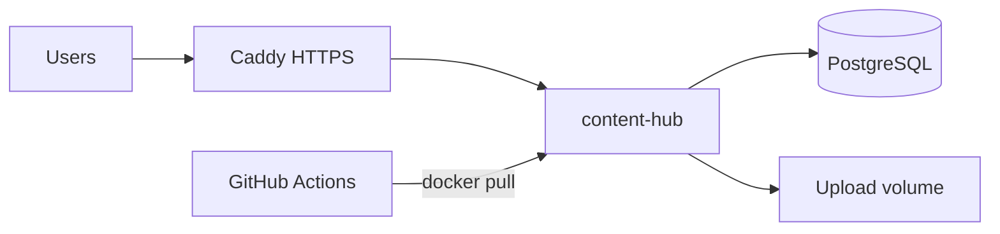

# Deploy Unified Carbonauten Platform on Hetzner

Cost-effective production start (~€4–5/month on CX22): one VPS runs the app, PostgreSQL, and HTTPS reverse proxy.

## Architecture



| Component | Service |
|-----------|---------|
| App | `content-hub` Docker image from GHCR |
| Database | PostgreSQL 16 (container) |
| HTTPS | Caddy + Let's Encrypt |
| Deploy | GitHub Actions → SSH |

**Estimated cost:** Hetzner CX22 ~€4.49/month (2 vCPU, 4 GB RAM).

---

## 1. Create Hetzner server

1. [Hetzner Cloud Console](https://console.hetzner.cloud/) → new project
2. **Add Server**
   - Location: Falkenstein or Nuremberg (EU)
   - Image: **Ubuntu 24.04**
   - Type: **CX22** (or CAX11 ARM for ~€3.79)
   - SSH key: add your public key
3. Note the server **IP address**

---

## 2. Bootstrap the server (once)

```bash
ssh root@YOUR_SERVER_IP

# Copy bootstrap script or run commands from repo:
apt-get update && apt-get install -y git
git clone https://github.com/YOUR_ORG/gitops-starter.git /tmp/gitops-starter
bash /tmp/gitops-starter/services/content-hub/deploy/hetzner/bootstrap.sh
```

---

## 3. Configure environment (once)

On the server:

```bash
mkdir -p /opt/unified-carbonauten-platform
cd /opt/unified-carbonauten-platform

# Copy from repo (or let GitHub Actions copy compose files on first deploy)
# docker-compose.yml, Caddyfile

cp /tmp/gitops-starter/services/content-hub/.env.example .env
nano .env
```

Required `.env` values:

| Variable | Example |
|----------|---------|
| `DOMAIN` | `platform.carbonauten.com` |
| `ACME_EMAIL` | `admin@carbonauten.com` |
| `POSTGRES_PASSWORD` | long random string |
| `SESSION_SECRET` | long random string |
| `AZURE_TENANT_ID` | from Entra app registration |
| `AZURE_CLIENT_ID` | from Entra app registration |
| `AZURE_CLIENT_SECRET` | from Entra app registration |
| `ENTRA_MOCK_AUTH` | `false` |

**DNS:** Create an **A record** pointing `DOMAIN` → server IP **before** starting Caddy.

**Entra ID:** Register redirect URI:

```text
https://YOUR_DOMAIN/api/auth/callback
```

---

## 4. First manual start

```bash
cd /opt/unified-carbonauten-platform

# If GHCR package is private:
echo YOUR_GITHUB_PAT | docker login ghcr.io -u YOUR_GITHUB_USER --password-stdin

docker compose pull
docker compose up -d
docker compose ps
docker compose logs -f content-hub
```

Open `https://YOUR_DOMAIN` in the browser.

---

## 5. Automatic deploy (GitHub Actions)

Add these **repository secrets** in GitHub → Settings → Secrets:

| Secret | Description |
|--------|-------------|
| `HETZNER_SSH_HOST` | Server IP or hostname |
| `HETZNER_SSH_USER` | `root` or deploy user |
| `HETZNER_SSH_PRIVATE_KEY` | Private SSH key (PEM) |
| `GHCR_PULL_TOKEN` | GitHub PAT with `read:packages` (if image is private) |

After each successful **CI** run on `main`, workflow `Deploy Content Hub to Hetzner` will:

1. Copy `docker-compose.yml` + `Caddyfile` to the server
2. `docker compose pull` + `docker compose up -d`

Manual deploy: **Actions** → **Deploy Content Hub to Hetzner** → **Run workflow**.

---

## 6. Useful commands on the server

```bash
cd /opt/unified-carbonauten-platform

docker compose ps
docker compose logs -f content-hub
docker compose restart content-hub
docker compose pull && docker compose up -d   # manual update
```

Backup PostgreSQL:

```bash
docker compose exec postgres pg_dump -U contenthub contenthub > backup.sql
```

---

## Upgrading later

| Phase | Change |
|-------|--------|
| More users | Resize Hetzner server (CX32, etc.) |
| More files | Attach Hetzner Volume or move to Azure Blob |
| China | Add Alibaba ECS (Sprint 5) |
| Enterprise | Migrate to Azure Container Apps / AKS |

The same Docker image works on Hetzner and Azure — no code changes required.
