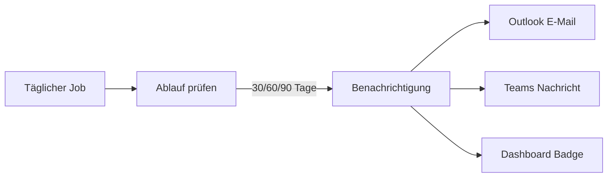

# Unified Carbonauten Platform — Sprint Roadmap

**Slogan:** FuckCo2 goes international

Produktions-Roadmap für die interne Multichannel-Plattform: Artikel, Dateien und **Zertifikate** zentral verwalten und an Microsoft 365 (Outlook, Teams) sowie Notion verteilen — nutzbar für technische und nicht-technische Mitarbeiter in Europa und China.

---

## Vision

Eine selbsterklärende Web-Plattform, auf der Teams Inhalte und Zertifikate einmal erfassen und gezielt an mehrere Kanäle veröffentlichen — mit Microsoft-Login, dreisprachiger Oberfläche (DE / EN / 中文) und kostengünstigem Betrieb über GitHub + Azure/Alibaba.

```mermaid
flowchart LR
    subgraph Sprint1["✅ Sprint 1"]
        Auth[Entra ID Login]
        I18n[DE / EN / 中文]
        Nav[Navigation]
    end

    subgraph Sprint2["Sprint 2"]
        Editor[Artikel-Editor]
        Files[Datei-Upload]
    end

    subgraph Sprint3["Sprint 3"]
        Certs[Zertifikatsverwaltung]
        Reminders[Ablauf-Erinnerungen]
    end

    subgraph Sprint4["Sprint 4"]
        Teams[Teams]
        Notion[Notion]
        Outlook[Outlook]
    end

    subgraph Sprint5["Sprint 5"]
        China[China Deployment]
        Sync[EU ↔ China Sync]
    end

    subgraph Sprint6["Sprint 6"]
        Workflow[Freigabe-Workflow]
        Audit[Audit & Monitoring]
    end

    Sprint1 --> Sprint2 --> Sprint3 --> Sprint4 --> Sprint5 --> Sprint6
```



---

## Sprint-Übersicht

| Sprint | Dauer | Status | Ziel |
|--------|-------|--------|------|
| 1 | 2 Wochen | ✅ Abgeschlossen | Fundament: Login, Branding, Mehrsprachigkeit, CI/CD |
| 2 | 2 Wochen | ✅ Abgeschlossen | Redaktion: Artikel-Editor, Dateiverwaltung, Suche |
| 3 | 2 Wochen | ✅ Abgeschlossen | **Zertifikatsverwaltung:** Erfassung, Ablauf, Erinnerungen |
| 4 | 2 Wochen | ✅ Abgeschlossen | Multichannel: Teams, Notion, Outlook |
| 5 | 2 Wochen | ✅ Abgeschlossen (MVP) | China: Alibaba-Deployment, Datensync EU ↔ CN |
| 6 | 1 Woche | ✅ Abgeschlossen (MVP) | Workflow, Freigaben, Audit, Go-Live |
| 7 | 1 Woche | ✅ Abgeschlossen (MVP) | Versionierung: Artikel- & Zertifikat-Historie |
| UI | 2–3 Tage | ✅ Abgeschlossen | Responsive Navigation, Status-Badges, Polish |
| 8+ | laufend | Backlog | Erweiterungen (siehe unten) |

---

## Sprint 1 — Fundament ✅

**Ziel:** Mitarbeiter können sich anmelden und die Plattform in ihrer Sprache nutzen.

### Deliverables

- [x] Projektstruktur `services/content-hub/`
- [x] FastAPI-Backend mit Entra-ID-Login (Mock-Modus für Dev)
- [x] React-Frontend mit Language Switch: `de`, `en`, `zh-CN`
- [x] Branding: Logo, **Unified Carbonauten Platform**, Slogan
- [x] Dashboard, Artikel, Dateien, **Zertifikate**, Veröffentlichen (Navigation)
- [x] GitHub Actions → GHCR
- [x] Helm Chart + Argo CD Manifest
- [x] Terraform-Scaffold Azure Container Apps
- [x] Tests (Backend)

### Akzeptanzkriterien

- Login mit Microsoft (oder Mock in Dev)
- UI vollständig in drei Sprachen umschaltbar
- CI baut und testet bei jedem Push
- Docker-Image lauffähig

---

## Sprint 2 — Redaktion & Dateien ✅

**Ziel:** Mitarbeiter können Artikel schreiben und Dateien hochladen — ohne technisches Know-how.

### Deliverables

- [x] WYSIWYG-Artikel-Editor (TipTap)
- [x] Artikel-CRUD: Erstellen, Bearbeiten, Löschen, Entwurf / Veröffentlicht
- [x] Vorlagen: Wochenbericht, Ankündigung, Protokoll
- [x] Datei-Upload per Drag & Drop
- [x] Ordnerstruktur (general, compliance, marketing)
- [x] Volltextsuche über Artikel und Dateinamen
- [x] SQLite/PostgreSQL via SQLAlchemy (`DATABASE_URL`)
- [x] Lokaler Dateispeicher (`UPLOAD_DIR`)
- [x] API-Tests

### Akzeptanzkriterien

- Redakteur erstellt Artikel mit Formatierung (fett, Listen, Links)
- Dateien werden hochgeladen und sind wieder auffindbar
- Suche liefert relevante Treffer in < 2 Sekunden
- Alle UI-Texte in DE / EN / 中文

### Technik

```
backend/app/models/article.py
backend/app/models/file.py
backend/app/routes/articles.py
backend/app/routes/files.py
frontend/src/pages/ArticleEditor.tsx
frontend/src/pages/FilesPage.tsx (erweitert)
```

---

## Sprint 3 — Zertifikatsverwaltung

**Ziel:** Alle relevanten Zertifikate an einem Ort — mit Ablaufüberwachung und automatischen Erinnerungen.

### Zertifikat-Typen

| Kategorie | Beispiele | Typische Nutzer |
|-----------|-----------|-----------------|
| Compliance & ISO | ISO 9001, ISO 14001, Audit-Berichte | Qualität, Management |
| Produktzertifikate | CE, REACH, Materialprüfungen | Produktion, Vertrieb |
| Schulungen & Personal | Erste-Hilfe, Gabelstapler, Sicherheit | HR, Teamleiter |
| SSL / Infrastruktur | TLS-Zertifikate, Domain-Certs | IT / DevOps |

### Geplante Features

- [x] Zertifikat anlegen: Name, Kategorie, Aussteller, Gültig von/bis
- [x] PDF/Datei-Upload pro Zertifikat (verknüpft mit Datei-Speicher aus Sprint 2)
- [x] Dashboard-Widget: „Läuft in 30/60/90 Tagen ab“
- [x] Ampel-Status: gültig / läuft ab / abgelaufen
- [x] Verantwortliche Person + E-Mail zuweisen
- [ ] Erinnerungen per **Outlook** (E-Mail) und **Teams** (Nachricht) — Sprint 4
- [x] Erneuerungs-Workflow: in Bearbeitung markieren
- [x] Filter & Suche nach Kategorie, Status, Aussteller
- [x] Export-Liste (CSV) für Audits
- [ ] Optional: SSL-Zertifikat-Import (.pem / .crt) mit automatischer Ablauf-Erkennung

### Akzeptanzkriterien

- Nicht-technischer Nutzer legt ein ISO-Zertifikat in < 3 Minuten an
- 30-Tage-Erinnerung wird automatisch an Verantwortlichen gesendet
- Dashboard zeigt alle ablaufenden Zertifikate auf einen Blick
- Audit-Export enthält alle Pflichtfelder
- UI vollständig in DE / EN / 中文

### Technik

```
backend/app/models/certificate.py
backend/app/routes/certificates.py
backend/app/workers/cert_expiry_reminder.py
frontend/src/pages/CertificatesPage.tsx (erweitert)
frontend/src/pages/CertificateDetail.tsx
frontend/src/components/CertificateForm.tsx
```

### Architektur Erinnerungen



---

## Sprint 4 — Multichannel-Veröffentlichung

**Ziel:** Ein Klick — Inhalt erscheint in Teams, Notion und als Outlook-Entwurf. Zertifikat-Erinnerungen nutzen dieselbe Graph-Anbindung.

### Geplante Features

- [x] Microsoft Graph: Teams-Kanal-Nachrichten senden
- [x] Microsoft Graph: Outlook-Entwurf / E-Mail mit Anhang
- [x] Notion API: Seite in Datenbank anlegen / aktualisieren
- [x] Veröffentlichen-Dialog mit Kanal-Checkboxen (Artikel)
- [x] Zertifikat-Benachrichtigungen über Graph (aus Sprint 3)
- [x] Status pro Kanal: ✓ gesendet / ⏳ wartet / ✗ Fehler
- [x] Automatischer Retry bei API-Fehlern
- [x] Veröffentlichungs-Historie pro Artikel
- [x] Admin: Kanäle konfigurieren (Teams-Team, Notion-DB, etc.)

### Akzeptanzkriterien

- Artikel wird an mindestens 2 von 3 Zielen erfolgreich gesendet
- Zertifikat-Ablauf-Erinnerung kommt per Outlook und Teams an
- Fehlgeschlagene Syncs sind sichtbar und manuell wiederholbar

### Berechtigungen (Entra / Graph)

| Permission | Zweck |
|------------|-------|
| `ChannelMessage.Send` | Teams-Nachrichten |
| `Mail.Send` / `Mail.ReadWrite` | Outlook-Erinnerungen |
| `Files.ReadWrite` | Anhänge via OneDrive/SharePoint |
| Notion Integration Token | Seiten + Dateien |

---

## Sprint 5 — China-Deployment ✅ (MVP)

**Ziel:** Mitarbeiter in China arbeiten mit akzeptabler Latenz — inkl. Zertifikatsdaten.

### Deliverables (MVP)

- [x] `DEPLOYMENT_REGION` (`eu` / `cn`) und Health-Endpoint
- [x] Alibaba OSS Storage-Backend (`STORAGE_BACKEND=oss`, optional `oss2`)
- [x] HTTP Sync API: Artikel + Zertifikate EU ↔ CN (`/api/sync/*`)
- [x] Dashboard: Regions-Badge + IT-Master Sync-Panel
- [x] `DEPLOY-CHINA.md` + Terraform-Scaffold `deploy/terraform-china/`
- [ ] Deployment auf Alibaba ECS (China-Region) — Infra bereit, manuelles Rollout
- [ ] Regionale URL: z. B. `platform.cn.carbonauten.com` — DNS/ICP ausstehend
- [ ] Kafka MirrorMaker 2 — Backlog für Produktionsskala
- [ ] Load Balancer / Geo-Routing (EU vs. CN)
- [ ] 21Vianet M365-Anbindung (falls China-Tenant)
- [ ] Performance-Tests aus China (Latenz < 3s Seitenaufbau)

### Akzeptanzkriterien (MVP)

- [x] Sync-API für Artikel und Zertifikate mit API-Key-Auth
- [x] OSS-kompatibler Dateispeicher (Upload/Download)
- [x] IT-Master kann Sync-Status sehen und manuell anstoßen
- [ ] China-Nutzer erreichen Plattform ohne VPN (nach ECS-Deploy)
- [ ] Dateien liegen regional vollständig repliziert (nur Metadaten-Sync im MVP)

---

## Sprint 6 — Workflow & Go-Live ✅ (MVP)

**Ziel:** Produktionsreifer Betrieb mit Freigaben und Nachvollziehbarkeit.

### Deliverables (MVP)

- [x] Freigabe-Workflow: Entwurf → Review → Veröffentlichen (Artikel)
- [x] Zertifikat-Erneuerung: Freigabe durch IT-Master oder Zertifikats-Manager
- [x] Rolle `certificate_manager` (Zertifikats-Manager)
- [x] Termin-Veröffentlichung (`scheduled` + Hintergrund-Scheduler)
- [x] Audit-Log (`/api/audit`) für Artikel, Zertifikate, Workflow-Aktionen
- [x] Monitoring-Summary (`/api/monitor/summary`) für IT-Master
- [x] Onboarding-Hilfe im Dashboard (DE / EN / 中文)
- [x] UI: Freigaben-Seite, Audit-Log, aktualisierter Artikel-Editor
- [ ] Entra-Gruppen-Mapping für Rollen — Backlog
- [ ] Produktions-Deployment EU — läuft auf Railway
- [ ] Pilot mit 10+ Nutzern — organisatorisch

### Akzeptanzkriterien (MVP)

- [x] Direktes Veröffentlichen durch Redakteure blockiert
- [x] Multichannel-Publish nur für `published`-Artikel
- [x] Vollständiges Audit für Compliance-Anfragen (IT-Master)
- [x] Zertifikat-Erneuerung erfordert Freigabe

---

## Sprint 7 — Versionierung ✅ (MVP)

**Ziel:** Änderungen an Artikeln und Zertifikaten nachvollziehen und vergleichen.

### Deliverables (MVP)

- [x] `ContentRevision`-Modell mit Snapshot pro Speichern
- [x] Automatische Version bei Artikel-Update (Titel/Inhalt)
- [x] Automatische Version bei Zertifikat-Update
- [x] API: `/api/versions/{article|certificate}/{id}`, Compare, Revision-Detail
- [x] UI: Versionshistorie im Artikel- und Zertifikat-Editor
- [x] Feldweise Diff gegen aktuelle Version
- [ ] Volltext-Diff / Wiederherstellen alter Version — Backlog

### Akzeptanzkriterien (MVP)

- [x] Jede Speicherung erzeugt eine nummerierte Version
- [x] Nutzer sieht Autor und Zeitstempel pro Version
- [x] Vergleich zeigt geänderte Felder (Titel, Inhalt, Zertifikatsdaten)

---

## UI Sprint — Responsive & Polish ✅

**Ziel:** Mobile-taugliche Navigation und konsistente visuelle Sprache über alle Kernseiten.

### Deliverables

- [x] Hamburger-Menü + Sidebar-Overlay auf kleinen Bildschirmen
- [x] Sticky TopBar, verbesserte Nav-Active-States
- [x] Farbige Workflow-Status-Badges (Artikel)
- [x] Dashboard-Stat-Karten mit Hover, Seiten-Enter-Animation
- [x] Toolbar- und Listen-Polish, `:focus-visible` für Tastatur
- [x] CSS-Bugfix: defekte `@media`-Query (900px) repariert
- [x] i18n: `nav.openMenu`, `dashboard.platformTip` (DE / EN / 中文)

### Akzeptanzkriterien

- [x] Navigation auf Mobilgeräten ohne horizontales Scrollen nutzbar
- [x] Artikel-Status auf einen Blick erkennbar
- [x] Einheitliche Button- und Banner-Stile

---

## Backlog (Sprint 8+)

| Thema | Beschreibung | Priorität |
|-------|--------------|-----------|
| Zertifikat-Ketten | Abhängigkeiten zwischen Zertifikaten (Parent/Child) | Hoch |
| Version Restore | Alte Version wiederherstellen | Mittel |
| Auto-Import CA | Let's Encrypt / Azure Key Vault Sync | Mittel |
| KI-Assistenz | Zusammenfassung, Übersetzung DE↔EN↔中文 | Mittel |
| SharePoint | Zertifikate aus SharePoint-Bibliothek importieren | Mittel |
| Mobile | Responsive Optimierung / PWA | ~~Niedrig~~ Teilweise (UI Sprint) |
| Analytics | Veröffentlichungs- und Zertifikat-Statistiken | Niedrig |

---

## Kosten-Richtwerte (monatlich)

### Phase 1 — Railway Start (empfohlen jetzt)

| Posten | Lösung | Kosten |
|--------|--------|--------|
| App-Hosting | Railway | Trial / ~$5–15/Monat |
| Datenbank | Railway PostgreSQL | inkl. / günstig |
| CI/CD + Registry | GitHub + GHCR | €0 |
| **Gesamt** | | **~$0–15/Monat** |

Siehe [DEPLOY-RAILWAY.md](./DEPLOY-RAILWAY.md).

### Später — Multi-Cloud

| Posten | EU | China | Summe |
|--------|-----|-------|-------|
| App-Hosting | Azure Container Apps | Alibaba ECS | ~15–25 € |
| Datenbank | Neon/Azure | RDS | ~5–17 € |
| Dateispeicher | Azure Blob | OSS | ~2–6 € |
| CI/CD + Registry | 0 € (GitHub) | — | 0 € |
| M365 + Notion APIs | 0 € (bestehende Lizenzen) | 0 € | 0 € |
| **Gesamt** | | | **~15–40 €/Monat** |

---

## Team & Rollen

| Rolle | Verantwortung |
|-------|---------------|
| Product Owner | Prioritäten, Akzeptanz, Pilotnutzer |
| Dev / GitOps | Implementierung, CI/CD, Terraform |
| Admin Entra/M365 | App Registration, Berechtigungen |
| Admin Notion | Integration, Datenbank-Schema |
| Zertifikats-Manager | Kategorien, Verantwortliche, Audit-Anforderungen |
| China IT | Alibaba-Zugang, 21Vianet ggf. |
| Pilot-Redakteure | Feedback nach jedem Sprint |

---

## Definition of Done (alle Sprints)

- [ ] Code im Repo, PR reviewed
- [ ] Tests grün (CI)
- [ ] UI-Texte in DE / EN / 中文
- [ ] README / Roadmap aktualisiert
- [ ] Keine Secrets im Code
- [ ] Demo für Stakeholder möglich

---

## Nächster Schritt

**Sprint 8+:** Siehe Backlog unten — Zertifikat-Ketten, KI-Assistenz, Analytics.

Siehe auch: [README.md](./README.md) für lokale Entwicklung und Deployment.
