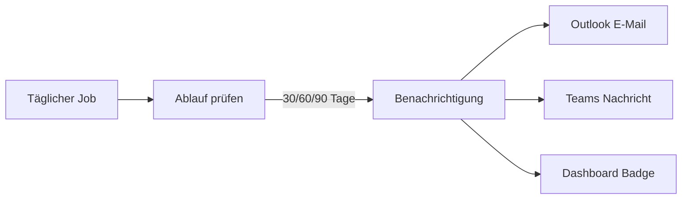

# Unified Carbonauten Platform — Sprint Roadmap

**Slogan:** FuckCo2 goes international

Produktions-Roadmap für die interne Multichannel-Plattform: Artikel, Dateien und **Zertifikate** zentral verwalten und an Microsoft 365 (Outlook, Teams) sowie Notion verteilen — nutzbar für technische und nicht-technische Mitarbeiter in Europa und China.

---

## Vision

Eine selbsterklärende Web-Plattform, auf der Teams Inhalte und Zertifikate einmal erfassen und gezielt an mehrere Kanäle veröffentlichen — mit Microsoft-Login, dreisprachiger Oberfläche (DE / EN / 中文) und kostengünstigem Betrieb über GitHub + Azure/Alibaba.


```mermaid
flowchart LR
    subgraph Sprint1["✅ Sprint 1"]
        Auth[Entra ID Login]
        I18n[DE / EN / 中文]
        Nav[Navigation]
    end

    subgraph Sprint2["Sprint 2"]
        Editor[Artikel-Editor]
        Files[Datei-Upload]
    end

    subgraph Sprint3["Sprint 3"]
        Certs[Zertifikatsverwaltung]
        Reminders[Ablauf-Erinnerungen]
    end

    subgraph Sprint4["Sprint 4"]
        Teams[Teams]
        Notion[Notion]
        Outlook[Outlook]
    end

    subgraph Sprint5["Sprint 5"]
        China[China Deployment]
        Sync[EU ↔ China Sync]
    end

    subgraph Sprint6["Sprint 6"]
        Workflow[Freigabe-Workflow]
        Audit[Audit & Monitoring]
    end

    Sprint1 --> Sprint2 --> Sprint3 --> Sprint4 --> Sprint5 --> Sprint6
```

---

## Sprint-Übersicht

| Sprint | Dauer | Status | Ziel |
|--------|-------|--------|------|
| 1 | 2 Wochen | ✅ Abgeschlossen | Fundament: Login, Branding, Mehrsprachigkeit, CI/CD |
| 2 | 2 Wochen | ✅ Abgeschlossen | Redaktion: Artikel-Editor, Dateiverwaltung, Suche |
| 3 | 2 Wochen | ✅ Abgeschlossen | **Zertifikatsverwaltung:** Erfassung, Ablauf, Erinnerungen |
| 4 | 2 Wochen | ✅ Abgeschlossen | Multichannel: Teams, Notion, Outlook |
| 5 | 2 Wochen | ✅ Abgeschlossen (MVP) | China: Alibaba-Deployment, Datensync EU ↔ CN |
| 6 | 1 Woche | ✅ Abgeschlossen (MVP) | Workflow, Freigaben, Audit, Go-Live |
| 7 | 1 Woche | ✅ Abgeschlossen (MVP) | Versionierung: Artikel- & Zertifikat-Historie |
| UI | 2–3 Tage | ✅ Abgeschlossen | Responsive Navigation, Status-Badges, Polish |
| UI 2 | 2–3 Tage | ✅ Abgeschlossen | Loading/Empty States, Badges, Audit-Mobile |
| Search + AI | 3–5 Tage | ✅ Abgeschlossen (MVP) | Zentrale Suche, KI-Fragen, ⌘K |
| A | 3–5 Tage | ✅ Abgeschlossen | Ask Carbonauten live: Translate, Summarize, richer RAG |
| B | 3–5 Tage | ✅ Abgeschlossen | Zertifikat-Ketten, Erinnerungen, Audit-Export |
| C | 3–5 Tage | ✅ Abgeschlossen | Mein Dashboard + Veröffentlichungskalender |
| D | 2–4 Tage | ✅ Abgeschlossen | Version Restore für Artikel & Zertifikate |
| E | 2–4 Tage | ✅ Abgeschlossen | Analytics Dashboard (Publish & Zertifikate) |
| F | 2–4 Tage | ✅ Abgeschlossen | SharePoint-Zertifikat-Import |
| G | 3–5 Tage | ✅ Abgeschlossen (Produktiv) | FuckCo2 Shop + Checkout + Bestellungen |
| H | 2–4 Tage | ✅ Abgeschlossen (MVP) | Auto-Import CA (PEM / LE / Key Vault) |
| I | 2–4 Tage | ✅ Abgeschlossen (MVP) | Shop-Retouren / Gutschriften |
| J | 2–4 Tage | ✅ Abgeschlossen (MVP) | Mobile PWA + Zertifikat-Ketten UI |
| K | 2–4 Tage | ✅ Abgeschlossen (MVP) | Shop-Versandverfolgung + Status-Mails |
| L | 2–4 Tage | ✅ Abgeschlossen (MVP) | Shop-Rechnungs-PDF |
| M | 2–4 Tage | ✅ Abgeschlossen (MVP) | Web-Reputation-Crawler + Löschanträge |
| 8+ | laufend | Backlog | Erweiterungen (siehe unten) |

---

## Sprint 1 — Fundament ✅

**Ziel:** Mitarbeiter können sich anmelden und die Plattform in ihrer Sprache nutzen.

### Deliverables

- [x] Projektstruktur `services/content-hub/`
- [x] FastAPI-Backend mit Entra-ID-Login (Mock-Modus für Dev)
- [x] React-Frontend mit Language Switch: `de`, `en`, `zh-CN`
- [x] Branding: Logo, **Unified Carbonauten Platform**, Slogan
- [x] Dashboard, Artikel, Dateien, **Zertifikate**, Veröffentlichen (Navigation)
- [x] GitHub Actions → GHCR
- [x] Helm Chart + Argo CD Manifest
- [x] Terraform-Scaffold Azure Container Apps
- [x] Tests (Backend)

### Akzeptanzkriterien

- Login mit Microsoft (oder Mock in Dev)
- UI vollständig in drei Sprachen umschaltbar
- CI baut und testet bei jedem Push
- Docker-Image lauffähig

---

## Sprint 2 — Redaktion & Dateien ✅

**Ziel:** Mitarbeiter können Artikel schreiben und Dateien hochladen — ohne technisches Know-how.

### Deliverables

- [x] WYSIWYG-Artikel-Editor (TipTap)
- [x] Artikel-CRUD: Erstellen, Bearbeiten, Löschen, Entwurf / Veröffentlicht
- [x] Vorlagen: Wochenbericht, Ankündigung, Protokoll
- [x] Datei-Upload per Drag & Drop
- [x] Ordnerstruktur (general, compliance, marketing)
- [x] Volltextsuche über Artikel und Dateinamen
- [x] SQLite/PostgreSQL via SQLAlchemy (`DATABASE_URL`)
- [x] Lokaler Dateispeicher (`UPLOAD_DIR`)
- [x] API-Tests

### Akzeptanzkriterien

- Redakteur erstellt Artikel mit Formatierung (fett, Listen, Links)
- Dateien werden hochgeladen und sind wieder auffindbar
- Suche liefert relevante Treffer in < 2 Sekunden
- Alle UI-Texte in DE / EN / 中文

### Technik

```
backend/app/models/article.py
backend/app/models/file.py
backend/app/routes/articles.py
backend/app/routes/files.py
frontend/src/pages/ArticleEditor.tsx
frontend/src/pages/FilesPage.tsx (erweitert)
```

---

## Sprint 3 — Zertifikatsverwaltung

**Ziel:** Alle relevanten Zertifikate an einem Ort — mit Ablaufüberwachung und automatischen Erinnerungen.

### Zertifikat-Typen

| Kategorie | Beispiele | Typische Nutzer |
|-----------|-----------|-----------------|
| Compliance & ISO | ISO 9001, ISO 14001, Audit-Berichte | Qualität, Management |
| Produktzertifikate | CE, REACH, Materialprüfungen | Produktion, Vertrieb |
| Schulungen & Personal | Erste-Hilfe, Gabelstapler, Sicherheit | HR, Teamleiter |
| SSL / Infrastruktur | TLS-Zertifikate, Domain-Certs | IT / DevOps |

### Geplante Features

- [x] Zertifikat anlegen: Name, Kategorie, Aussteller, Gültig von/bis
- [x] PDF/Datei-Upload pro Zertifikat (verknüpft mit Datei-Speicher aus Sprint 2)
- [x] Dashboard-Widget: „Läuft in 30/60/90 Tagen ab“
- [x] Ampel-Status: gültig / läuft ab / abgelaufen
- [x] Verantwortliche Person + E-Mail zuweisen
- [x] Erinnerungen per **Outlook** (E-Mail) und **Teams** (Nachricht) — Sprint 4
- [x] Erneuerungs-Workflow: in Bearbeitung markieren
- [x] Filter & Suche nach Kategorie, Status, Aussteller
- [x] Export-Liste (CSV) für Audits
- [x] Optional: SSL-Zertifikat-Import (.pem / .crt) mit automatischer Ablauf-Erkennung

### Akzeptanzkriterien

- Nicht-technischer Nutzer legt ein ISO-Zertifikat in < 3 Minuten an
- 30-Tage-Erinnerung wird automatisch an Verantwortlichen gesendet
- Dashboard zeigt alle ablaufenden Zertifikate auf einen Blick
- Audit-Export enthält alle Pflichtfelder
- UI vollständig in DE / EN / 中文

### Technik

```
backend/app/models/certificate.py
backend/app/routes/certificates.py
backend/app/workers/cert_expiry_reminder.py
frontend/src/pages/CertificatesPage.tsx (erweitert)
frontend/src/pages/CertificateDetail.tsx
frontend/src/components/CertificateForm.tsx
```

### Architektur Erinnerungen


```mermaid
flowchart LR
    Cron[Täglicher Job] --> Check[Ablauf prüfen]
    Check -->|30/60/90 Tage| Notify[Benachrichtigung]
    Notify --> Outlook[Outlook E-Mail]
    Notify --> Teams[Teams Nachricht]
    Notify --> Dashboard[Dashboard Badge]
```

---

## Sprint 4 — Multichannel-Veröffentlichung

**Ziel:** Ein Klick — Inhalt erscheint in Teams, Notion und als Outlook-Entwurf. Zertifikat-Erinnerungen nutzen dieselbe Graph-Anbindung.

### Geplante Features

- [x] Microsoft Graph: Teams-Kanal-Nachrichten senden
- [x] Microsoft Graph: Outlook-Entwurf / E-Mail mit Anhang
- [x] Notion API: Seite in Datenbank anlegen / aktualisieren
- [x] Veröffentlichen-Dialog mit Kanal-Checkboxen (Artikel)
- [x] Zertifikat-Benachrichtigungen über Graph (aus Sprint 3)
- [x] Status pro Kanal: ✓ gesendet / ⏳ wartet / ✗ Fehler
- [x] Automatischer Retry bei API-Fehlern
- [x] Veröffentlichungs-Historie pro Artikel
- [x] Admin: Kanäle konfigurieren (Teams-Team, Notion-DB, etc.)

### Akzeptanzkriterien

- Artikel wird an mindestens 2 von 3 Zielen erfolgreich gesendet
- Zertifikat-Ablauf-Erinnerung kommt per Outlook und Teams an
- Fehlgeschlagene Syncs sind sichtbar und manuell wiederholbar

### Berechtigungen (Entra / Graph)

| Permission | Zweck |
|------------|-------|
| `ChannelMessage.Send` | Teams-Nachrichten |
| `Mail.Send` / `Mail.ReadWrite` | Outlook-Erinnerungen |
| `Files.ReadWrite` | Anhänge via OneDrive/SharePoint |
| Notion Integration Token | Seiten + Dateien |

---

## Sprint 5 — China-Deployment ✅ (MVP)

**Ziel:** Mitarbeiter in China arbeiten mit akzeptabler Latenz — inkl. Zertifikatsdaten.

### Deliverables (MVP)

- [x] `DEPLOYMENT_REGION` (`eu` / `cn`) und Health-Endpoint
- [x] Alibaba OSS Storage-Backend (`STORAGE_BACKEND=oss`, optional `oss2`)
- [x] HTTP Sync API: Artikel + Zertifikate EU ↔ CN (`/api/sync/*`)
- [x] Dashboard: Regions-Badge + IT-Master Sync-Panel
- [x] `DEPLOY-CHINA.md` + Terraform-Scaffold `deploy/terraform-china/`
- [ ] Deployment auf Alibaba ECS (China-Region) — Infra bereit, manuelles Rollout
- [ ] Regionale URL: z. B. `platform.cn.carbonauten.com` — DNS/ICP ausstehend
- [ ] Kafka MirrorMaker 2 — Backlog für Produktionsskala
- [ ] Load Balancer / Geo-Routing (EU vs. CN)
- [ ] 21Vianet M365-Anbindung (falls China-Tenant)
- [ ] Performance-Tests aus China (Latenz < 3s Seitenaufbau)

### Akzeptanzkriterien (MVP)

- [x] Sync-API für Artikel und Zertifikate mit API-Key-Auth
- [x] OSS-kompatibler Dateispeicher (Upload/Download)
- [x] IT-Master kann Sync-Status sehen und manuell anstoßen
- [ ] China-Nutzer erreichen Plattform ohne VPN (nach ECS-Deploy)
- [ ] Dateien liegen regional vollständig repliziert (nur Metadaten-Sync im MVP)

---

## Sprint 6 — Workflow & Go-Live ✅ (MVP)

**Ziel:** Produktionsreifer Betrieb mit Freigaben und Nachvollziehbarkeit.

### Deliverables (MVP)

- [x] Freigabe-Workflow: Entwurf → Review → Veröffentlichen (Artikel)
- [x] Zertifikat-Erneuerung: Freigabe durch IT-Master oder Zertifikats-Manager
- [x] Rolle `certificate_manager` (Zertifikats-Manager)
- [x] Termin-Veröffentlichung (`scheduled` + Hintergrund-Scheduler)
- [x] Audit-Log (`/api/audit`) für Artikel, Zertifikate, Workflow-Aktionen
- [x] Monitoring-Summary (`/api/monitor/summary`) für IT-Master
- [x] Onboarding-Hilfe im Dashboard (DE / EN / 中文)
- [x] UI: Freigaben-Seite, Audit-Log, aktualisierter Artikel-Editor
- [ ] Entra-Gruppen-Mapping für Rollen — Backlog
- [ ] Produktions-Deployment EU — läuft auf Railway
- [ ] Pilot mit 10+ Nutzern — organisatorisch

### Akzeptanzkriterien (MVP)

- [x] Direktes Veröffentlichen durch Redakteure blockiert
- [x] Multichannel-Publish nur für `published`-Artikel
- [x] Vollständiges Audit für Compliance-Anfragen (IT-Master)
- [x] Zertifikat-Erneuerung erfordert Freigabe

---

## Sprint 7 — Versionierung ✅ (MVP)

**Ziel:** Änderungen an Artikeln und Zertifikaten nachvollziehen und vergleichen.

### Deliverables (MVP)

- [x] `ContentRevision`-Modell mit Snapshot pro Speichern
- [x] Automatische Version bei Artikel-Update (Titel/Inhalt)
- [x] Automatische Version bei Zertifikat-Update
- [x] API: `/api/versions/{article|certificate}/{id}`, Compare, Revision-Detail
- [x] UI: Versionshistorie im Artikel- und Zertifikat-Editor
- [x] Feldweise Diff gegen aktuelle Version
- [ ] Volltext-Diff / Wiederherstellen alter Version — Backlog

### Akzeptanzkriterien (MVP)

- [x] Jede Speicherung erzeugt eine nummerierte Version
- [x] Nutzer sieht Autor und Zeitstempel pro Version
- [x] Vergleich zeigt geänderte Felder (Titel, Inhalt, Zertifikatsdaten)

---

## UI Sprint — Responsive & Polish ✅

**Ziel:** Mobile-taugliche Navigation und konsistente visuelle Sprache über alle Kernseiten.

### Deliverables

- [x] Hamburger-Menü + Sidebar-Overlay auf kleinen Bildschirmen
- [x] Sticky TopBar, verbesserte Nav-Active-States
- [x] Farbige Workflow-Status-Badges (Artikel)
- [x] Dashboard-Stat-Karten mit Hover, Seiten-Enter-Animation
- [x] Toolbar- und Listen-Polish, `:focus-visible` für Tastatur
- [x] CSS-Bugfix: defekte `@media`-Query (900px) repariert
- [x] i18n: `nav.openMenu`, `dashboard.platformTip` (DE / EN / 中文)

### Akzeptanzkriterien

- [x] Navigation auf Mobilgeräten ohne horizontales Scrollen nutzbar
- [x] Artikel-Status auf einen Blick erkennbar
- [x] Einheitliche Button- und Banner-Stile

---

## UI Sprint 2 — Components & Consistency ✅

**Ziel:** Wiederverwendbare UI-Bausteine und konsistente Darstellung auf allen Listen- und Admin-Seiten.

### Deliverables

- [x] `LoadingState` und `EmptyState` als gemeinsame Komponenten
- [x] `CertificateStatusBadge` und `DeliveryStatusBadge` (Publish-Historie)
- [x] Sidebar-Navigation mit Icons
- [x] Workflow-Seite: Status-Badges für Artikel und Zertifikat-Erneuerungen
- [x] Audit-Log: Aktions-Badges + Kartenansicht auf Mobilgeräten
- [x] Mobile: Workflow-Aktionen und Listen-Buttons volle Breite
- [x] i18n: aktualisierter `dashboard.platformTip` (DE / EN / 中文)

### Akzeptanzkriterien

- [x] Alle Kernlisten zeigen Spinner statt Plain-Text „Laden…“
- [x] Leere Zustände sind visuell einheitlich
- [x] Zertifikats- und Publish-Status nutzen dasselbe Badge-System wie Artikel

---

## Search + AI Sprint — Zentrale Suche ✅ (MVP)

**Ziel:** Suche als wichtigstes Feature — inkl. KI-gestützter Fragen.

### Deliverables

- [x] Dedizierte `/search`-Seite mit Filter (Artikel / Dateien / Zertifikate)
- [x] Globale Suche in TopBar + Dashboard-Hero + Sidebar-Eintrag
- [x] Live-Suche mit Vorschlägen, `⌘K` / `Ctrl+K`
- [x] API: `/api/search/ask`, `/api/search/suggestions`, Relevanz-Scoring
- [x] KI-Modus: Azure OpenAI oder OpenAI (RAG über Treffer)
- [x] Fallback ohne KI: Keyword-Extraktion + Treffer-Zusammenfassung
- [x] Health: `ai_search_configured`

### Akzeptanzkriterien

- [x] Nutzer findet Inhalte von jeder Seite aus (TopBar / Dashboard)
- [x] Natürliche Fragen liefern Antwort + Quellen
- [x] DE / EN / 中文 für alle neuen UI-Texte

---

## Sprint A — Ask Carbonauten live ✅

**Ziel:** KI als produktives Feature: Fragen, Übersetzen, Zusammenfassen — nur aus firmeneigenen Inhalten.

### Deliverables

- [x] Ask Carbonauten Branding in Suche / Ask-Modus
- [x] Reichere RAG-Kontexte (Artikelinhalt, Zertifikatsdetails)
- [x] API: `/api/ai/status`, `/api/ai/translate`, `/api/ai/summarize`
- [x] Artikel-Editor: Übersetzung DE / EN / 中文 + Zusammenfassung
- [x] Längere Timeouts für KI-Requests im Frontend
- [x] Tests für AI-Status, Translate, Summarize, Ask-Branding

### Akzeptanzkriterien

- [x] Ohne API-Key: klare Hinweise, Keyword-Fallback weiterhin nutzbar
- [x] Mit Azure OpenAI / OpenAI: Übersetzen ersetzt Titel+Inhalt im Editor
- [x] Ask-Antworten referenzieren Plattform-Quellen

---

## Sprint B — Zertifikat-Ketten & Compliance Pack ✅

**Ziel:** Zertifikate als Compliance-Operating-System: Ketten, zuverlässige Erinnerungen, Audit-Export.

### Deliverables

- [x] Parent/Child-Ketten (`parent_id`) inkl. Zykluserkennung
- [x] Eskalations-E-Mail zusätzlich zur verantwortlichen Person
- [x] Erinnerungen 90/60/30 Tage — einmalig pro Fenster, mit Tracking-Feldern
- [x] Direkte E-Mail (Resend/SMTP) + Teams/Outlook Publish-Kanäle
- [x] Stündlicher Hintergrund-Job für fällige Erinnerungen
- [x] Audit-Paket ZIP: `certificates.csv`, `chains.json`, `summary.json`, `README.md`
- [x] UI: Parent-Auswahl, Kind-Liste, Audit-Export-Button

### Akzeptanzkriterien

- [x] Root→Child-Beziehungen sind in Liste und Editor sichtbar
- [x] Löschen eines Parents mit Kindern wird blockiert
- [x] Erinnerungen feuern nicht doppelt für dasselbe Fenster
- [x] Auditoren können ein ZIP-Paket herunterladen

---

## Sprint C — Mein Dashboard & Publish-Kalender ✅

**Ziel:** Tägliche Nutzung: persönlicher Einstieg + Kalender für Veröffentlichungen und Abläufe.

### Deliverables

- [x] API `/api/dashboard/home` — meine Entwürfe, Freigaben, ablaufende Zertifikate, Neuigkeiten
- [x] API `/api/dashboard/calendar` — geplante Artikel, Publikationen, Zertifikatsabläufe (+ Outlook wenn verbunden)
- [x] Dashboard: persönliches Home-Grid + Kalender-Widget
- [x] Seite `/calendar` + Nav-Eintrag „Kalender“ (getrennt von Veröffentlichen)
- [x] Pro User: Outlook-Kalender & E-Mail per OAuth im Kalender-Tab
- [x] DE / EN / 中文

### Akzeptanzkriterien

- [x] Nutzer sieht morgens zuerst die eigene Arbeit
- [x] Geplante Veröffentlichungen und Abläufe sind im Kalender sichtbar
- [x] Nav highlightet Kalender und Veröffentlichen getrennt
- [x] Jeder User kann eigenen Outlook-Kalender & E-Mail verbinden
- [x] Klick führt direkt zum Editor / Publish

---

## Sprint D — Version Restore ✅

**Ziel:** Alte Artikel- und Zertifikat-Stände wiederherstellen.

### Deliverables

- [x] API `POST /api/versions/{type}/{id}/restore/{version}`
- [x] Vor Restore wird der aktuelle Stand als neue Version gesichert
- [x] Erste Version wird bereits beim Anlegen gespeichert
- [x] UI-Button **Wiederherstellen** in der Versionshistorie
- [x] Editor lädt nach Restore die wiederhergestellten Felder
- [x] DE / EN / 中文

### Akzeptanzkriterien

- [x] Nach Speichern ist mindestens Version 1 sichtbar
- [x] Restore setzt Felder auf den alten Stand zurück
- [x] Aktueller Stand bleibt in der Historie erhalten

---

## Sprint E — Analytics Dashboard ✅

**Ziel:** Veröffentlichungs- und Zertifikat-Statistiken für Redaktion und Management.

### Deliverables

- [x] API `GET /api/analytics/overview?days=` — Artikel, Zertifikate, Publikationen, Kanäle
- [x] KPIs: Bestände, Ablauf 30/60/90, Audit-Aktionen, Dateien
- [x] Trend: Publikationen pro Tag + Zustellung nach Kanal (ok/Fehler)
- [x] UI `/analytics` mit Zeitraum 30/90/180 Tage
- [x] Nav-Eintrag „Analytics“ / „数据分析“
- [x] DE / EN / 中文

### Akzeptanzkriterien

- [x] Angemeldete Nutzer sehen Übersichtsstatistiken ohne Extra-Rolle
- [x] Zeitraumfilter aktualisiert Publikationen und Audit-Zähler
- [x] Zertifikatsstatus und Kategorien sind sichtbar

---

## Sprint F — SharePoint-Zertifikat-Import ✅

**Ziel:** Zertifikatsdateien aus der SharePoint-Firmenbibliothek in die Plattform übernehmen.

### Deliverables

- [x] Graph-Download: SharePoint Drive-Item → Plattform-`FileAsset`
- [x] API `POST /api/files/import-from-sharepoint`
- [x] API `POST /api/certificates/import-from-sharepoint` (Name/Kategorie aus Dateiname, Defaults für Gültigkeit)
- [x] UI: Import-Picker auf Zertifikatsliste + Datei-Anhang im Editor
- [x] Mock-Bibliothek inkl. Ordner „Zertifikate“ für Demo ohne Graph
- [x] DE / EN / 中文

### Akzeptanzkriterien

- [x] Redakteur importiert eine SharePoint-Datei als neues Zertifikat
- [x] Datei liegt danach als Plattform-Anhang vor
- [x] Ohne SharePoint-Konfiguration funktioniert der Demo-/Mock-Import

---

## Sprint G — FuckCo2 Shop ✅ (Produktiv)

**Ziel:** Produktiv shoppen auf `fuckco2.shop`; Produkte & Bestellungen in der Unified Platform.

### Deliverables

- [x] Produktverwaltung inkl. Lagerbestand, MwSt., Bild, Veröffentlichen
- [x] Öffentlicher Storefront mit Warenkorb & Checkout
- [x] Zahlarten: **Stripe** (Karte) und **Rechnung** (IBAN)
- [x] Bestell-E-Mails an Kunde + Shop-Postfach
- [x] Admin **Bestellungen** (bezahlt / versendet / storniert)
- [x] Rechtstexte Impressum / Datenschutz / AGB (Env)
- [x] DNS/Railway-Doku für `fuckco2.shop`
- [x] DE / EN / 中文

### Akzeptanzkriterien

- [x] Kunde kann Produkte in den Warenkorb legen und bestellen
- [x] Mit Stripe-Key: Redirect zur Stripe Checkout Session
- [x] Ohne Stripe: Rechnungskauf mit Bestellnummer + E-Mail
- [x] Redaktion sieht und bearbeitet Bestellungen in der Platform

---

## Backlog (Sprint 8+)

| Thema | Beschreibung | Priorität |
|-------|--------------|-----------|
| Zertifikat-Ketten | Abhängigkeiten zwischen Zertifikaten (Parent/Child) | ~~Hoch~~ ✅ Sprint B |
| Version Restore | Alte Version wiederherstellen | ~~Mittel~~ ✅ Sprint D |
| Auto-Import CA | Let's Encrypt / Azure Key Vault Sync | ~~Mittel~~ ✅ Sprint H |
| Shop Checkout | Zahlung / Warenkorb für fuckco2.shop | ~~Mittel~~ ✅ Sprint G |
| Shop Retouren | Retourenportal / Gutschriften | ~~Niedrig~~ ✅ Sprint I |
| KI-Assistenz | Zusammenfassung, Übersetzung DE↔EN↔中文 | ~~Mittel~~ ✅ Sprint A |
| SharePoint | Zertifikate aus SharePoint-Bibliothek importieren | ~~Mittel~~ ✅ Sprint F |
| Mobile | Responsive Optimierung / PWA | ~~Niedrig~~ ✅ Sprint J |
| Analytics | Veröffentlichungs- und Zertifikat-Statistiken | ~~Niedrig~~ ✅ Sprint E |
| Shop Versand | Sendungsverfolgung + Status-E-Mails | ~~Mittel~~ ✅ Sprint K |
| Shop Rechnung PDF | Rechnungs-/Beleg-PDF Download | ~~Mittel~~ ✅ Sprint L |
| Web-Reputation | Crawler + negative Treffer + Löschantrag | ~~Mittel~~ ✅ Sprint M |

---

## Kosten-Richtwerte (monatlich)

### Phase 1 — Railway Start (empfohlen jetzt)

| Posten | Lösung | Kosten |
|--------|--------|--------|
| App-Hosting | Railway | Trial / ~$5–15/Monat |
| Datenbank | Railway PostgreSQL | inkl. / günstig |
| CI/CD + Registry | GitHub + GHCR | €0 |
| **Gesamt** | | **~$0–15/Monat** |

Siehe [DEPLOY-RAILWAY.md](./DEPLOY-RAILWAY.md).

### Später — Multi-Cloud

| Posten | EU | China | Summe |
|--------|-----|-------|-------|
| App-Hosting | Azure Container Apps | Alibaba ECS | ~15–25 € |
| Datenbank | Neon/Azure | RDS | ~5–17 € |
| Dateispeicher | Azure Blob | OSS | ~2–6 € |
| CI/CD + Registry | 0 € (GitHub) | — | 0 € |
| M365 + Notion APIs | 0 € (bestehende Lizenzen) | 0 € | 0 € |
| **Gesamt** | | | **~15–40 €/Monat** |

---

## Team & Rollen

| Rolle | Verantwortung |
|-------|---------------|
| Product Owner | Prioritäten, Akzeptanz, Pilotnutzer |
| Dev / GitOps | Implementierung, CI/CD, Terraform |
| Admin Entra/M365 | App Registration, Berechtigungen |
| Admin Notion | Integration, Datenbank-Schema |
| Zertifikats-Manager | Kategorien, Verantwortliche, Audit-Anforderungen |
| China IT | Alibaba-Zugang, 21Vianet ggf. |
| Pilot-Redakteure | Feedback nach jedem Sprint |

---

## Definition of Done (alle Sprints)

- [ ] Code im Repo, PR reviewed
- [ ] Tests grün (CI)
- [ ] UI-Texte in DE / EN / 中文
- [ ] README / Roadmap aktualisiert
- [ ] Keine Secrets im Code
- [ ] Demo für Stakeholder möglich

---

## Sprint H — Auto-Import CA ✅ (MVP)

**Ziel:** SSL/TLS-Zertifikate automatisch erkennen und aus Datei, Let's Encrypt oder Azure Key Vault übernehmen.

### Deliverables

- [x] PEM/CRT/CER/DER-Parser (`cryptography`) mit Ablaufdatum, Aussteller, Fingerprint, SAN
- [x] API `POST /api/certificates/parse-ssl` und `POST /api/certificates/import-ssl`
- [x] Upsert nach Fingerprint (kein Duplikat bei erneutem Import)
- [x] SharePoint-Import: SSL-Dateien füllen Datum/Aussteller automatisch
- [x] Editor: Upload von `.pem/.crt/.cer` füllt Formularfelder
- [x] Let's Encrypt Sync aus `LETSENCRYPT_LIVE_DIR` (`cert.pem` / `fullchain.pem`)
- [x] Azure Key Vault Sync (`AZURE_KEY_VAULT_URL` + Entra) inkl. `KEY_VAULT_MOCK_MODE`
- [x] Felder `fingerprint`, `external_source`, `external_id`
- [x] DE / EN / 中文 + Tests

### Akzeptanzkriterien

- [x] Redakteur importiert PEM und sieht korrekte Gültigkeit ohne manuelle Datums-Eingabe
- [x] Erneuter Import derselben Datei aktualisiert statt zu duplizieren
- [x] Key-Vault-Mock-Sync legt SSL-Zertifikate in der Platform an

---

## Sprint I — Shop-Retouren / Gutschriften ✅ (MVP)

**Ziel:** Kunden können Retouren anfragen; Shop-Redaktion prüft und schließt ab (Lager + CO₂-Rückbuchung). Geldrückerstattung bleibt manuelle Gutschrift.

### Deliverables

- [x] Modell `shop_returns` (`requested|approved|rejected|completed`)
- [x] Kunden-API: `POST /api/shop/auth/me/orders/{id}/returns`, `GET /api/shop/auth/me/returns`
- [x] Admin-API: `GET/PATCH /api/shop-returns`
- [x] Retourenfenster `SHOP_RETURN_WINDOW_DAYS` (Default 30)
- [x] Abschluss: Lager wiederherstellen + CO₂-Clawback + Order-Status `returned`
- [x] Shop-Konto: Retoure anfragen + eigene Retouren
- [x] Platform: Shop → Retouren
- [x] DE / EN / 中文 + Tests

### Akzeptanzkriterien

- [x] Kunde kann nur bei `paid`/`fulfilled` innerhalb der Frist retournieren
- [x] Eine offene/abgeschlossene Retoure pro Bestellung
- [x] Abschluss stellt Tracked-Inventory wieder her und bucht CO₂ zurück (Floor 0)
- [x] Ablehnung ändert Lager/Credits nicht

---

## Sprint J — Mobile PWA & Zertifikat-Ketten ✅ (MVP)

**Ziel:** Platform und Shop installierbar machen; Zertifikatsketten in der UI sichtbar; mobile Bedienung nachschärfen.

### Deliverables

- [x] Web App Manifest + Icons (192/512 + Apple Touch)
- [x] Service Worker via `vite-plugin-pwa` (Shell offline, `/api` network-only)
- [x] Install-Banner (DE / EN / 中文) für Platform und Shop
- [x] Shop-Manifest (`manifest-shop.webmanifest`) auf Shop-Hosts
- [x] Zertifikate: Ansicht **Liste / Ketten** mit rekursivem Tree (`GET /api/certificates/chains`)
- [x] Mobile: Header-Aktionen, Toolbar und Shop-Topbar wrap/stack
- [x] Nginx: Manifest/SW ohne Long-Cache; Tests für PWA-Assets

### Akzeptanzkriterien

- [x] Build liefert Manifest, Icons und Service Worker
- [x] Ketten-Ansicht zeigt Parent → Child → Grandchild
- [x] API-Aufrufe werden vom SW nicht aggressiv gecacht

---

## Sprint K — Shop-Versandverfolgung & Status-Mails ✅ (MVP)

**Ziel:** Versendete Bestellungen mit Carrier/Tracking erfassen und Kunden per E-Mail informieren.

### Deliverables

- [x] Felder `shipping_carrier`, `tracking_number`, `tracking_url` an Shop-Orders
- [x] Admin: Versandformular beim Markieren als versendet (+ Tracking später speichern)
- [x] Auto-Tracking-URL für DHL/DPD/UPS/Hermes/GLS/Deutsche Post
- [x] E-Mail an Kunde (+ Shop-Inbox) bei Versand und Storno
- [x] Shop-Konto und Bestellseite zeigen Tracking-Link
- [x] DE / EN / 中文 + Tests

### Akzeptanzkriterien

- [x] Redaktion kann Bestellung mit Sendungsnummer als versendet markieren
- [x] Kunde erhält Versand-Mail mit Track-&-Trace-Link
- [x] Storno stellt Tracked-Inventory wieder her und benachrichtigt den Kunden

---

## Sprint L — Shop-Rechnungs-PDF ✅ (MVP)

**Ziel:** Kunden und Redaktion können eine Rechnung/einen Zahlungsbeleg als PDF herunterladen.

### Deliverables

- [x] PDF-Generator (`reportlab`) mit Positionen, MwSt, Bankdaten
- [x] Public: `GET /api/shop/orders/{number}/invoice.pdf?token=…`
- [x] Kundenkonto: `GET /api/shop/auth/me/orders/{id}/invoice.pdf`
- [x] Admin: `GET /api/orders/{id}/invoice.pdf`
- [x] Link in Bestell-E-Mail + UI (Konto, Success, Bestellungen)
- [x] DE / EN / 中文 + Tests

### Akzeptanzkriterien

- [x] PDF beginnt mit `%PDF` und enthält Rechnungsnummer `RE-…`
- [x] Download ohne gültigen Token ist 404
- [x] Rechnungskauf zeigt IBAN/Verwendungszweck im PDF

---

## Sprint M — Web-Reputation-Crawler ✅ (MVP)

**Ziel:** Öffentliche Artikel und Meldungen zu carbonauten GmbH / FuckCo2 sammeln, negative Treffer hervorheben, Löschanträge intern dokumentieren.

### Deliverables

- [x] Crawler: DuckDuckGo-HTML + Google-News-RSS + LinkedIn `site:`-Suchen (kein Login, Rate-Limit)
- [x] Sentiment: negativ / neutral / positiv (Keyword-Score)
- [x] UI **Web-Reputation** mit Filter, Crawl-Button, Quelle öffnen
- [x] Löschantrag mit Begründung, Briefvorlage, interner E-Mail
- [x] Geplanter Crawl alle `REPUTATION_CRAWL_INTERVAL_HOURS` (Default 6)
- [x] DE / EN / 中文 + Tests

### Akzeptanzkriterien

- [x] Redaktion sieht negative Treffer zuerst / per Filter
- [x] Löschantrag erzeugt Brief + verhindert Duplikate (409)
- [x] Viewer hat keinen Zugriff

---

## Nächster Schritt

**Sprint N (Vorschlag):** Entra-Gruppen-Mapping oder Volltext-Diff — nach PO-Priorität.

Siehe auch: [README.md](./README.md) für lokale Entwicklung und Deployment.
